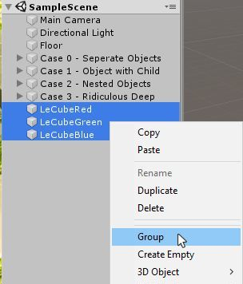

# Grouping Tool

## Description
The Nementic Grouping Tool is a small Unity tool which groups the selected GameObjects under a new parent GameObject. The parent will be created under the next common parent GameObject of the selected objects and will be centered between them. When calling the tool a small pop-up window is shown where the name of the new parent GameObject can be set. The tool can be called via a shortcut which is configurable in Unity's shortcut manager and the right-click context menu. The pop-up window can be disabled in the preferences and a default label for the group GameObject can be set. Disabling the pop-up window in the preferences will instantly group the selected GameObjects in a group with the default name 'New Group' when the shortcut or the context menu entry is used. Fully supports undo.

## Setup
This tool has no dependencies other than the Unity editor itself and becomes available as soon as it is installed. The currently verified Unity version is 2019.1.

## Usage
Select multiple GameObjects in the SceneView, right-click and select the context menu entry 'Group' or use the shortcut defined in Unity's shortcut manager (default is 'Control + G').
A pop-up will open in which you can define the name of the new group. Click on the 'Group' button or hit enter to execute the grouping. The grouping will be cancelled if you click outside of the pop-up window.
